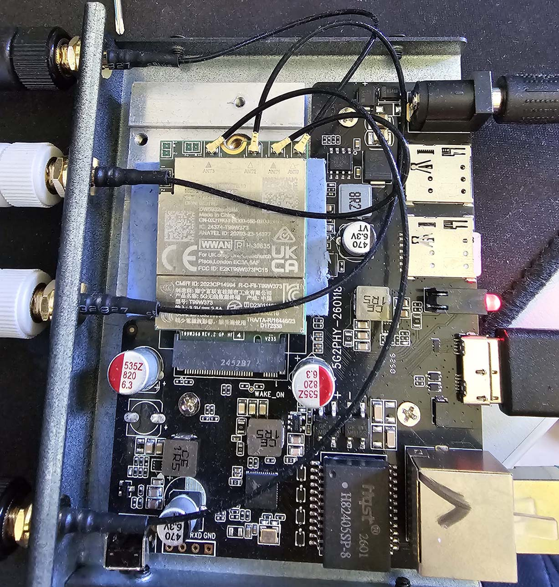
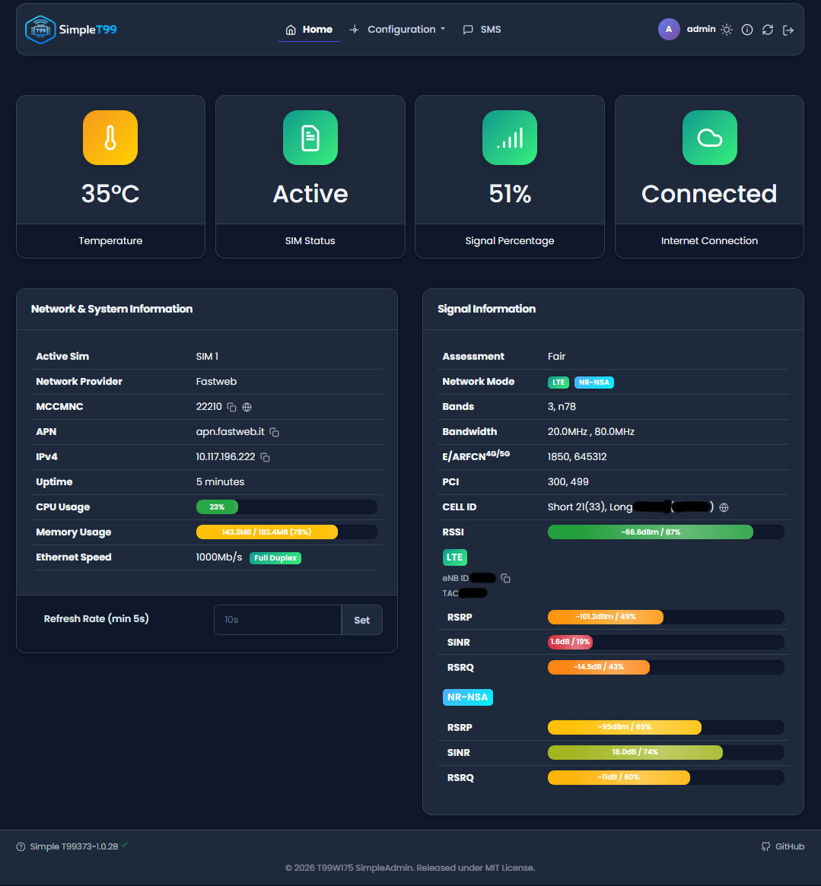
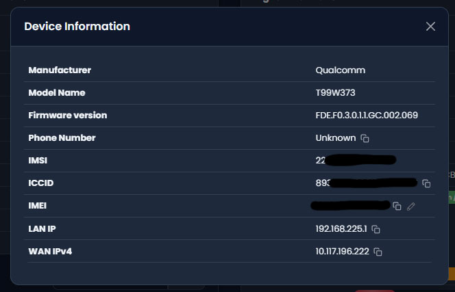
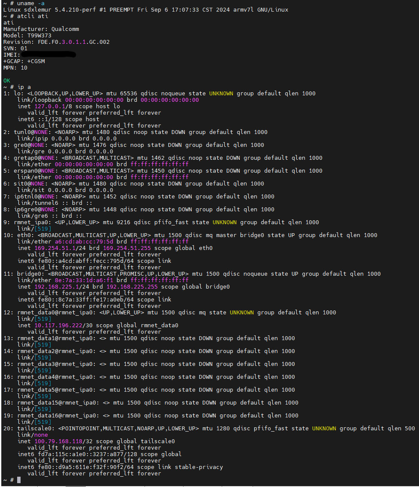
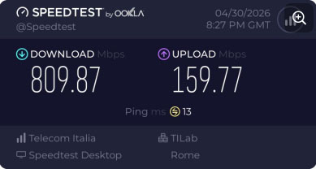

# T99W373 PCIe-RC Modem Bundle 🚀

This repository publishes the first semi-stable self-installing bundle for the Foxconn T99W373 modem.

The release artifact is a single tar archive:

```text
qcmap-modem-bundle-v9-NON-ES-rx1024.tar
```

> [!WARNING]
> **Urgent notice for v8 / v1.0.0 users:** upgrade to `v9 / v1.0.1` as soon
> as possible. Bundle v8 can fill the modem root filesystem because repeated
> IPA dedupe snapshots are written under `/root/ipa_stabilize_backups`. Once
> rootfs reaches 100%, QCMAP configuration files may be truncated, causing WAN
> routing failure even when PCIe and the WebUI still appear to work.

---

## 🎯 Supported target

| Item                | Status                                                                                  |
| ------------------- | --------------------------------------------------------------------------------------- |
| Modem               | Foxconn T99W373 / SDX62                                                                 |
| Firmware            | See firmware compatibility notes below                                                  |
| Kernel              | `5.4.210-perf` ARMv7                                                                    |
| Device family       | Locked / production / NON-ES                                                           |
| Ethernet controller | Realtek RTL8125                                                                         |
| Bundle version      | `v9 NON-ES RX1024`                                                                      |
| WebUI version       | [`Simple T99373-1.0.2B`](https://github.com/Brazzo978/T99W175-simpleadmin/tree/T99W373) |
| LAN default         | `192.168.225.1/24`                                                                      |

---

## ⚠️ Firmware compatibility and risk warning

The exact full firmware compatibility matrix for the T99W373 is not known yet.

This bundle is known to work on firmware:

```text
FDE.F0.3.0.1.1.GC.002.069
```

and some newer firmware revisions.

It has also been successfully tested across multiple firmware versions from 2024 to 2026. However, unusual carrier builds, engineering builds, old firmware revisions or unknown board/software revisions may behave differently.

**Warning:** installing this bundle on an unsupported or unusual firmware may hard-brick the modem. In that case, recovery may only be possible through EDL mode using the physical EDL test points on the modem PCB.

Use this bundle only if you understand the risk and you are prepared to recover the modem through EDL if something goes wrong.

---

## ✅ Pre-install checklist

Before using this bundle, make sure the modem satisfies the following requirements.

### 1. The modem should be in `CUSTOMER=0` mode

The modem should be set to:

```text
CUSTOMER=0
```

`CUSTOMER=0` disables the FCC lock behavior and allows the modem to connect to the network without requiring an unlock command from the host PC.

You can set it using the same AT command used on the T99W175:

```text
AT^CUSTOMER=0
```

On the T99W373 this command is unreliable and may only be accepted intermittently. The recommended method is to prepare a Windows machine with the modem COM port already installed, then repeatedly send the command during modem boot until it is accepted.

Sometimes it may require 100-200 attempts before the modem accepts the command.

Once `CUSTOMER=0` is successfully set, it should not need to be done again.

If your modem is already in `CUSTOMER=0`, you can skip this step.

### 2. AT command interface must work

Before installing the bundle, verify that the modem responds to AT commands.

For example:

```text
AT
```

should return:

```text
OK
```

### 3. `ATI` should show valid modem information

Run:

```text
ATI
```

and verify that the modem responds correctly and shows valid device information, including a valid IMEI.

Do not continue if the modem does not respond to AT commands or if `ATI` does not show a valid IMEI.

---

## 🛠 Install

Download the release asset from GitHub, then push it to the modem:

```sh
adb push qcmap-modem-bundle-v9-NON-ES-rx1024.tar /foxusr/qcmap-modem-bundle-v9.tar
```

Run the installer:

```sh
adb shell 'rm -rf /foxusr/qcmap-install && mkdir -p /foxusr/qcmap-install && tar -C /foxusr/qcmap-install -xf /foxusr/qcmap-modem-bundle-v9.tar && cd /foxusr/qcmap-install/qcmap-modem-bundle-v9-NON-ES-rx1024 && ROOT_PASSWORD=123 ENABLE_WEB_CLIENT=1 sh ./install-full-stack-on-modem.sh'
```

During an interactive install, the script asks:

```text
Do you want to install the SSH server? [Y/n]
Do you want to install btop? [Y/n]
```

For non-interactive installs, you can pass the choices through the environment:

```sh
INSTALL_SSH_SERVER=1 INSTALL_BTOP=1 ROOT_PASSWORD=123 ENABLE_WEB_CLIENT=1 sh ./install-full-stack-on-modem.sh
```

Use `0` instead of `1` to skip one of the optional components.

The modem reboots automatically when the installer completes.

Interactive installation is recommended. Installation can take a very long time; ideally it should complete within 10 minutes.

---

## 🌐 After install

Default access:

| Service               | Address                                    |
| --------------------- | ------------------------------------------ |
| WebUI                 | `http://192.168.225.1`                     |
| SSH, if enabled       | `root@192.168.225.1`                       |
| Default root password | `123`, unless changed with `ROOT_PASSWORD` |

---

## 📦 What the bundle installs

* QCMAP runtime configured for WAN over RMNET and LAN on `bridge0`.
* LAN defaults to `192.168.225.1/24` with DHCP and NAT.
* Runtime PCIe enablement for locked T99W373 devices through `pcie_enabler_non_es_v1.ko`.
* Realtek / IPA Ethernet module stack: `rmnet_eth.ko`, `r8125_stack.ko`, `ioss_rebuilt.ko`, `r8125_ioss_rebuilt.ko`.
* Final IPA UL/DL userspace fix: `libipacm_abi_bridge_final.so`, patched `ipacm.service`, `ipa-iptables-dedupe.timer`, `ipa-stack-healthcheck.timer`, and `/usr/bin/ipa-ul-final-status.sh`.
* T99W373 SimpleAdmin WebUI on the modem HTTP server.
* WebUI Settings support for subnet, DHCP range and lease configuration.
* Custom TTL runtime and WebUI control.
* Automatic reboot scheduler.
* Connection watchdog with long boot grace for slow T99W373 WAN startup.
* Tailscale WebUI helper.
* v9 small-filesystem cleanup:
  * dedupe backups are volatile and capped in `/tmp`;
  * old v8 `/root/ipa_stabilize_backups` residue is removed;
  * stale install staging folders are cleaned when they are not the current payload;
  * old `/data/coredump/core.*` files are removed by default.
* Optional Dropbear SSH server. Installing SSH is strongly recommended. Please do install it.
* Optional `btop`. No working `htop` build was available during testing.

The bundle does not set the APN. If the APN is not automatically inserted by the MBN configuration, please set it manually. Even if the GUI does not look responsive, push the APN setting anyway.

---
## 📸 Photos / Working setup

Below are a few pictures of the T99W373 running with this bundle.

### Modem installed and running



### WebUI dashboard



### WebUI device information



### SSH access and runtime status



### Example real-world throughput capability



Verified Ookla result: [View result](https://www.speedtest.net/result/d/3fa18052-9f86-480e-8abf-42a53b51bba0)

> This result is provided only to show that the PCIe-RC + RTL8125 + QCMAP/IPA stack
> can sustain real traffic through the modem. It is not a performance guarantee.
> Actual throughput depends on network conditions, carrier configuration, SIM plan,
> APN, bands, CA/NR availability, signal quality, cell load, firmware and antenna setup.
---

## 📚 Research documentation

The long technical history, PCIe/IPA bring-up notes, module lineage and intermediate experiments are kept in:

* [`RESEARCH.md`](RESEARCH.md)
* [`final-working-files/FINAL_FILES_EXPLAINED.md`](final-working-files/FINAL_FILES_EXPLAINED.md)
* [`final-working-files/VERSION_EVOLUTION.md`](final-working-files/VERSION_EVOLUTION.md)
* [`final-working-files/intermediate-steps/README.md`](final-working-files/intermediate-steps/README.md)
* [`final-working-files/source-build-context/README.md`](final-working-files/source-build-context/README.md)

Start from the release bundle if you want to install the working setup. Read the research notes if you want to understand how the PCIe, Realtek, QCMAP and IPA pieces were discovered.

---

## 💬 Questions, Support & Requests

For any questions, feature requests or support, feel free to reach out on Telegram:

👉 [Telegram Group](https://t.me/ltesperimentazioni)

---

## License

This project is licensed under the PolyForm Noncommercial License 1.0.0.

Use, modification and redistribution are allowed only for non-commercial purposes.

Commercial use, resale, paid redistribution, SaaS offering, or profit-driven modification is prohibited without prior written permission from the author.

Seriously, I will personally come and kick your butt.
